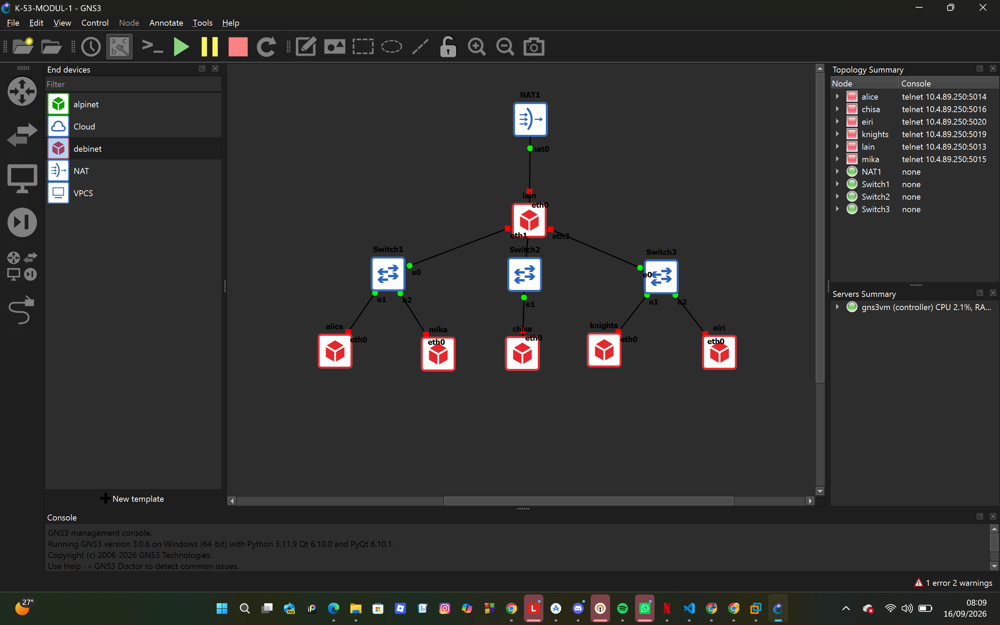
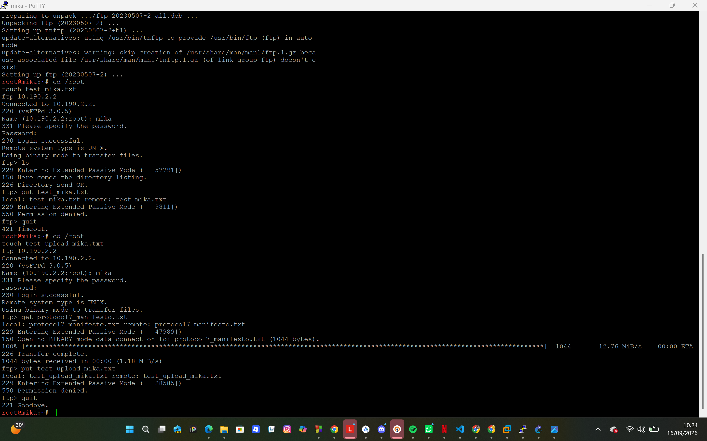

## LAPORAN RESMI PRAKTIKUM KOMUNIKASI DATA DAN JARINGAN KOMPUTER
MODUL 1: SERIAL EXPERIMENTS LAIN (THE WIRED)

##### Kelompok: K-053

### PENDAHULUAN / LATAR BELAKANG
Praktikum Modul 1 Komunikasi Data dan Jaringan Komputer mengangkat tema Serial Experiments Lain, di mana arsitektur jaringan dibangun untuk merepresentasikan sistem The Wired. Praktikum ini berfokus pada konfigurasi dasar router, manajemen antarmuka jaringan (interface), pengaturan NAT/masquerade, firewall, DHCP/DNS resolver, analisis trafik menggunakan Wireshark, konfigurasi FTP server, layanan Telnet, pemindaian port (port scanning) dengan Netcat, pengamanan akses jarak jauh menggunakan SSH Key-based Authentication, serta analisis berbagai file packet capture (pcap) untuk investigasi keamanan siber (analisis brute-force, USB HID keystroke, FTP theft, C2 traffic, SMB transfer, SMTP threat, dan dekripsi TLS).


## Laporan

### 1. Topologi & Konfigurasi Awal Interface

Untuk mempersiapkan pembangunan The Wired, Lain yang berperan sebagai Router membuat tiga Switch/Gateway: Switch 1 menuju dua entitas yaitu Alice dan Mika, Switch 2 menuju Chisa, sedangkan Switch 3 menuju Knights dan Eiri. Kelima entitas tersebut dikonfigurasi sebagai Client di GNS3.
#### Topologi
Router **Lain** membuat tiga Switch/Gateway: Switch 1 menuju dua entitas (**Alice** dan **Mika**), Switch 2 menuju **Chisa**, dan Switch 3 menuju dua entitas (**Knights** dan **Eiri**). Kelima entitas tersebut dikonfigurasi sebagai Client di GNS3, dengan prefix IP kelompok `10.190.x.x`.

**Switch 1**: Menghubungkan Alice dan Mika (Subnet 10.190.1.0/24).
**Switch 2**: Menghubungkan Chisa (Subnet 10.190.2.0/24).
**Switch 3**: Menghubungkan Knights dan Eiri (Subnet 10.190.3.0/24).



**Lain**

```
auto eth0
iface eth0 inet dhcp
auto eth1
iface eth1 inet static
    address 10.190.1.1
    netmask 255.255.255.0
auto eth2
iface eth2 inet static
    address 10.190.2.1
    netmask 255.255.255.0
auto eth3
iface eth3 inet static
    address 10.190.3.1
    netmask 255.255.255.0
```

**Alice**

```
auto eth0
iface eth0 inet static
    address 10.190.1.2
    netmask 255.255.255.0
    gateway 10.190.1.1
```

**Mika**

```
auto eth0
iface eth0 inet static
    address 10.190.1.3
    netmask 255.255.255.0
    gateway 10.190.1.1
```

**Chisa**

```
auto eth0
iface eth0 inet static
    address 10.190.2.2
    netmask 255.255.255.0
    gateway 10.190.2.1
```

**Knights**

```
auto eth0
iface eth0 inet static
    address 10.190.3.2
    netmask 255.255.255.0
    gateway 10.190.3.1
```

**Eiri**

```
auto eth0
iface eth0 inet static
    address 10.190.3.3
    netmask 255.255.255.0
    gateway 10.190.3.1
```


### 2. Router Lain Terhubung ke Internet Publik (NAT/DHCP)

Karena menurut Lain pada saat itu The Wired masih terisolasi dari dunia luar, router Lain dikonfigurasikan agar dapat tersambung langsung ke jaringan internet publik melalui NAT/DHCP pada interface `eth0`.

```
echo "nameserver 8.8.8.8" > /etc/resolv.conf
sysctl -w net.ipv4.ip_forward=1
```

**Verifikasi:**

```
ping -c 2 google.com
```


### 3. Konektivitas Antar-Client Melalui Routing

Setelah router Lain terhubung ke internet, seluruh entitas (Client) di bawah Switch 1, Switch 2, dan Switch 3 dapat saling terhubung dan berkomunikasi satu sama lain melalui konfigurasi routing.

Aktifkan IP Forwarding di router Lain:

```
sysctl -w net.ipv4.ip_forward=1
```

**Pembuktian — Alice (Subnet 1) ke Chisa (Subnet 2):**

```
ping -c 2 10.190.2.2
```


**Pembuktian — Knights (Subnet 3) ke Mika (Subnet 1):**

```
ping -c 2 10.190.1.3
```


### 4. Kemandirian Client ke Internet (NAT Masquerade + DNS)

Lain ingin agar setiap entitas (Client) memiliki kemandirian di The Wired. Firewall/iptables (NAT Masquerade) dan DNS resolver dikonfigurasikan agar setiap client dapat terhubung ke internet secara mandiri.

```
sysctl -w net.ipv4.ip_forward=1
iptables -t nat -A POSTROUTING -o eth0 -j MASQUERADE
iptables -A FORWARD -i eth1 -o eth0 -j ACCEPT
iptables -A FORWARD -i eth2 -o eth0 -j ACCEPT
iptables -A FORWARD -i eth3 -o eth0 -j ACCEPT
iptables -A FORWARD -i eth0 -m state --state ESTABLISHED,RELATED -j ACCEPT
```

Pada masing-masing client:

```
echo "nameserver 8.8.8.8" > /etc/resolv.conf
```

**Verifikasi:**

```
ping -c 2 8.8.8.8
ping -c 2 google.com
```


### 5. Persistensi Konfigurasi Setelah Restart

Eiri tetap berupaya menanamkan kekacauan ke dalam jaringan. Untuk mengantisipasi restart tiba-tiba, seluruh konfigurasi jaringan dipastikan tidak hilang saat semua node direstart dengan menambahkan konfigurasi langsung ke `/etc/network/interfaces` pada router Lain, serta membuat script verifikasi.

**Menambahkan config di Lain:**

```
auto eth0
iface eth0 inet dhcp
auto eth1
iface eth1 inet static
    address 10.190.1.1
    netmask 255.255.255.0
auto eth2
iface eth2 inet static
    address 10.190.2.1
    netmask 255.255.255.0
auto eth3
iface eth3 inet static
    address 10.190.3.1
    netmask 255.255.255.0
up sysctl -w net.ipv4.ip_forward=1
up iptables -t nat -A POSTROUTING -o eth0 -j MASQUERADE
```

**Script verifikasi `nano /root/cek_status.sh`:**

```sh
#!/bin/sh
echo "=========================================="
echo "         RINGKASAN INTERFACE IP           "
echo "=========================================="
ip -br a

echo ""
echo "=========================================="
echo "          STATUS TABEL NAT (IPTABLES)     "
echo "=========================================="
iptables -t nat -L -v -n
```

```
chmod +x /root/cek_status.sh
/root/cek_status.sh
```


### 6. Packet Sniffing DNS/ICMP pada Node Mika

Mika mencurigai adanya anomali traffic pada segmen jaringannya. Generator traffic dijalankan pada node Mika, lalu packet sniffing dilakukan menggunakan Wireshark pada interface node Mika dengan display filter khusus untuk paket berprotokol DNS atau ICMP.

**`nano /root/traffic_protocol7.sh`:**

```sh
#!/bin/sh
while true; do
    ping -c 1 10.190.1.1 > /dev/null 2>&1
    nslookup google.com 8.8.8.8 > /dev/null 2>&1
    nc -z -w 1 10.190.1.1 80 > /dev/null 2>&1
    sleep 2
done
```

```
chmod +x /root/traffic_protocol7.sh
/root/traffic_protocol7.sh &
```

Display filter Wireshark: `dns || icmp`


File pcap no.6 [disini](File_pcap/soal_6.pcapng)

### 7. FTP Server di Chisa dengan Kebijakan Akses per User

Chisa memutuskan mendirikan FTP Server pada node miliknya dengan shared folder di `/var/wired/data`. Kebijakan akses yang diterapkan: user `alice` (read & write), user `mika` (read-only), dan user `eiri` (tanpa izin akses / blacklist).

**Konfigurasi di Chisa:**

```
echo "nameserver 8.8.8.8" > /etc/resolv.conf
apt update && apt install -y --allow-unauthenticated vsftpd

mkdir -p /var/wired/data
chmod 777 /var/wired/data
chown -R ftp:nogroup /var/wired/data

useradd -m -s /bin/ alice 2>/dev/null
useradd -m -s /bin/ mika 2>/dev/null
useradd -m -s /bin/ eiri 2>/dev/null

echo "alice:password" | chpasswd
echo "mika:password" | chpasswd
echo "eiri:password" | chpasswd

cat << 'EOF' > /etc/vsftpd.conf
listen=YES
listen_ipv6=NO
anonymous_enable=NO
local_enable=YES
write_enable=YES
local_umask=022
check_shell=NO
local_root=/var/wired/data
chroot_local_user=YES
allow_writeable_chroot=YES
userlist_enable=YES
userlist_file=/etc/vsftpd.userlist
userlist_deny=NO
user_config_dir=/etc/vsftpd_user_conf
EOF

echo -e "alice\nmika" > /etc/vsftpd.userlist

mkdir -p /etc/vsftpd_user_conf
echo "write_enable=NO" > /etc/vsftpd_user_conf/mika

service vsftpd restart
service vsftpd status
```

`userlist_deny=NO` bersama `userlist_file` yang hanya memuat `alice` dan `mika` membuat kedua user tersebut menjadi satu-satunya yang diizinkan login FTP, sehingga user `eiri` otomatis ditolak (blacklist secara implisit).

**Pembuktian Alice (read & write), membuat `signal_alice.txt`:**

```
echo "nameserver 8.8.8.8" > /etc/resolv.conf
apt install -y --allow-unauthenticated ftp
cd /root
touch signal_alice.txt
ftp 10.190.2.2
```


**Pembuktian Mika (read-only):**

```
echo "nameserver 8.8.8.8" > /etc/resolv.conf
apt update --fix-missing
apt install -y --allow-unauthenticated ftp
cd /root
touch test_mika.txt
ftp 10.190.2.2
```


**Pembuktian Eiri (ditolak akses):**

```
echo "nameserver 8.8.8.8" > /etc/resolv.conf
apt update --fix-missing
apt install -y --allow-unauthenticated ftp
ftp 10.190.2.2
```


### 8. Upload FTP dari Knights ke Chisa via Akun Alice + Analisis Wireshark

Kelompok rahasia Knights perlu mengirimkan dokumen laporan intelijen ke FTP Server Chisa. Koneksi FTP client dilakukan dari node Knights ke FTP Server Chisa menggunakan akun `alice`, lalu sesi tersebut dianalisis dengan Wireshark.

Jangan lupa untuk memulai capture pada Knights

```
apt update --fix-missing
apt install -y --allow-unauthenticated ftp wget tshark
cd /root
wget --no-check-certificate '<link_file>' -O knights_report.txt

tshark -i eth0 -f "host 10.190.2.2" -w /tmp/soal8.pcap >/dev/null 2>&1 &

echo "nameserver 8.8.8.8" > /etc/resolv.conf
apt update && apt install -y ftp

ftp 10.190.2.2
# login sebagai alice
passive
put knights_report.txt
quit

pkill tshark
tshark -r /tmp/soal8.pcap -Y "ftp || ftp-data"
tshark -r /tmp/soal8.pcap -Y "ftp.response.code == 229"
```


File pcap no 8 [disni](File_pcap/soal_8.pcapng)

**Analisis & Jawaban Soal 8:**

- Perintah FTP untuk Upload: STOR knights_report.txt (Terlihat pada baris nomor 33: Request: STOR knights_report.txt).
- Kode Status Sukses Server: 226 Transfer complete (Terlihat pada baris nomor 43: Response: 226 Transfer complete).
- Port Data TCP yang Dinegosiasikan pada Mode PASV: Saat mengetik perintah passive, koneksi berpindah ke mode Active (EPRT). Nan, untuk mendapatkan respon mode PASV, jalankan perintah berikut untuk melihat baris respon 227 Entering Passive Mode beserta portnya. 59535 (Didapat dari respon 229 Entering Extended Passive Mode (|||59535|))


### 9. Download File dari Chisa oleh Mika + Pembatasan Read-Only

Mika mengakses dokumen Protokol Tujuh dari FTP Server Chisa. Dari node Mika, file tersebut diunduh menggunakan akun `mika`, kemudian pembatasan read-only dibuktikan dengan mencoba mengunggah file baru dari akun `mika`.

**Di Chisa**  menyiapkan file:

```
cd /var/wired/data
wget --no-check-certificate '<link_file>' -O protocol7_manifesto.txt
chmod 644 /var/wired/data/protocol7_manifesto.txt
```


**Di Mika:**

```
cd /root
touch test_upload_mika.txt
ftp 10.190.2.2
# User: mika | Password: password
get protocol7_manifesto.txt
put test_upload_mika.txt
quit
```

Mika berhasil download namun gagal upload (550 Permission denied)


Upload dari akun `mika` ditolak server dengan pesan `550 Permission denied` karena konfigurasi `write_enable=NO` pada `/etc/vsftpd_user_conf/mika`, sesuai kebijakan read-only.

### 10. Uji Latensi Ping Knights → Chisa (77 Paket, 128 Byte, Interval 0.3s)

Knights melancarkan uji ketahanan koneksi ke server Chisa untuk menguji latensi jaringan The Wired.

```
ping -c 77 -s 128 -i 0.3 10.190.2.2
```

**1. Detail Header ICMP**

- Echo (Ping) Request (Knights → Chisa): **Type 8, Code 0**
- Echo (Ping) Reply (Chisa → Knights): **Type 0, Code 0**

**2. Statistik Transmisi & Packet Loss**

- Packets Transmitted: **77**
- Packets Received: **77**
- Packet Loss: **0%**

**3. Statistik Latensi Network (RTT)**

- Min: **0.219 ms**
- Avg: **0.449 ms**
- Max: **0.948 ms**


File pcap no.10 [disini](File_pcap/soal_10.pcapng)

### Soal 11: Analisis Kelemahan Telnet (Plaintext & Character at a Time)
Konfigurasi di Node Chisa:
```BASH
useradd -m -s /bin/bash phantom_user
echo "phantom_user:wired_ghost" | chpasswd
apt update && apt install -y telnetd openbsd-inetd
# Konfigurasi /etc/inetd.conf (aktifkan layanan telnet)
service openbsd-inetd restart
```
Pengujian dari Eiri:
```BASH
telnet 10.190.2.2
# Login: phantom_user / wired_ghost
```
.png)
.png)
Hasil Analisis Wireshark (Follow TCP Stream): Kredensial (phantom_user dan wired_ghost) terlihat jelas dalam bentuk plain text. Setiap karakter yang diketik dikirim dalam segmen TCP terpisah karena Telnet menggunakan mode character-at-a-time.

Soal 12: Port Scanning dengan Netcat & Analisis TCP Flag
Konfigurasi Layanan di Knights:
```BASH
apt update && apt install -y openssh-server apache2
service ssh start
service apache2 start
```
Eksekusi Port Scan dari Alice:
```BASH
nc -zv 10.190.3.2 22
nc -zv 10.190.3.2 80
nc -zv 10.190.3.2 7777
```
.png)

Tampilan pada Wireshark :
.png)
nc -zv 10.190.3.2 22
.png)
nc -zv 10.190.3.2 80
.png)
nc -zv 10.190.3.2 7777

Analisis Wireshark:
Port Terbuka (22 & 80): Server merespons paket SYN dari Alice dengan flag SYN-ACK.
Port Tertutup (7777): Server merespons dengan flag RST-ACK (Reset-Acknowledgment).


Soal 13: Konfigurasi SSH Aman dengan Public Key Authentication
Konfigurasi Server (Knights):
```BASH
apt update && apt install -y openssh-server
useradd -m -s /bin/bash mika_admin
passwd mika_admin
# Ubah /etc/ssh/sshd_config: PubkeyAuthentication yes, PasswordAuthentication no
service ssh restart
```
Generate Key Pair di Mika:
```BASH
ssh-keygen -t rsa -b 2048
ssh-copy-id mika_admin@10.190.3.2
```
.png)
.png)
.png)
.png)
Pengujian & Analisis: Koneksi berhasil tanpa password. Pada Wireshark (filter ssh), terlihat proses Protocol Version Exchange dan Key Exchange (KEX). Setelah negosiasi kunci, seluruh sesi terenkripsi end-to-end, mencegah kebocoran kredensial layaknya Telnet.

Soal 14: Investigasi Brute-Force Serangan Web (wired_bruteforce.pcapng)
Kronologi & Langkah Pengerjaan:
Buka file di Wireshark :
.png)
1. Alamat IP Penyerang & Target (Beserta Port):
-Ketik filter di Wireshark: http atau tcp.port == 80 (atau port web server yang digunakan).
-IP Penyerang: Lihat alamat IP dari node Eiri yang mengirimkan banyak permintaan HTTP secara beruntun (biasanya terlihat pengulangan POST request ke form login).
-Target IP & Port: Lihat alamat IP Alice (sebagai web server) dan port yang diserang (biasanya port 80 untuk HTTP atau 443 untuk HTTPS).
.png)
IP Penyerang (Attacker): 172.26.7.50 (karena IP ini yang terus-menerus mengirimkan POST /login.php secara beruntun).
Target IP: 172.26.7.100 (IP server yang diserang).
Port yang Diserang: Berdasarkan panel bawah bagian Transmission Control Protocol, target menggunakan Port 8080 (Dst Port: 8080).

2. Password lain_admin yang Berhasil Ditembus:
-Ketik filter untuk melihat isi paket HTTP POST: http.request.method == "POST" atau klik kanan pada salah satu paket HTTP POST > Follow > TCP Stream.
-Scroll ke bawah pada aliran stream tersebut untuk melihat percobaan brute-force beruntun hingga ditekan kombinasi password untuk user lain_admin yang memberikan respons sukses (misalnya kode status HTTP 200 OK atau redirect, berbeda dari percobaan sebelumnya yang gagal). Password yang berhasil tembus biasanya ada di baris percobaan terakhir user tersebut.
.png)
Password = wired_pr0tocol_7

3. Web Server Software & Versi pada Response Header:
-Cari paket balasan HTTP dari server (biasanya bertuliskan HTTP/1.1 200 OK atau 302 Found).
-Klik paket tersebut, lalu lihat bagian Hypertext Transfer Protocol di panel tengah.
-Cari baris Server: (contoh: Apache/2.4.38 (Debian), nginx/1.14.2, dll.) untuk mencatat software web server beserta versi persisnya.
.png)
Server = Apache/2.4.62

Validasi Socket Server:
```BASH
nc [IP_Group] 3401
```
.png)
Flag: KOMJAR26{W1r3d_Brut3_ofGWOszZFdRWl2gbaXEJsvORj}

Soal 15: Investigasi Perangkat USB HID / Rubber Ducky (wired_usb_hid.pcap)
1. Kronologi & Langkah Pengerjaan:
-Buka File .pcap di Wireshark
-Unduh file wired_usb_hid.pcap dari tautan Google Drive praktikum.
-Buka aplikasi Wireshark dan buka file tersebut.

2. Cara Mengidentifikasi Parameter di Wireshark
Vendor ID (VID) & Product ID (PID):
-Ketik filter di kolom atas Wireshark: usb.descriptor atau usb (cari paket yang mengandung USB Device Descriptor).
-Cari paket yang menampilkan rincian perangkat (Device Descriptor). Di panel tengah (Packet Details), luaskan bagian USB Device Descriptor, di sana  akan melihat nilai idVendor (misalnya 0x1d6b atau format 4 digit hex) dan idProduct (misalnya 0x0104). 
.png)
idVendor = Logitech, Inc. (0x046d)
idProduct = Keyboard K120 (0xc31c)

Alamat Nomor Device USB (Device Address):
-Di dalam paket penjelas perangkat USB yang sama (atau paket USB URB awal), cari atribut bernama Bus ID dan Device Address (biasanya berupa angka desimal kecil seperti 3 atau 2). Nilai --Device Address inilah yang ditanyakan.
.png)
USB Device Address signed to keyboard = 7

Pesan Rahasia dari Keystroke (USB HID Keyboard Data):
-Ketik filter untuk melihat lalu lintas data keyboard: usb.capdata atau usbhid.
-Perangkat rubber ducky / keyboard berbahaya mengirimkan data keystroke melalui paket Interrupt Transfer (biasanya berupa Leftover Capture Data sepanjang 8 byte).
.png)
Karena data mentah USB HID berupa scancode (kode tombol, misal 0x04 untuk huruf 'a'),  bisa melihat kolom Info atau mengekstrak datanya menggunakan skrip Python sederhana (seperti menggunakan pustaka pyshark atau dpkt) untuk menerjemahkan scancode tersebut menjadi string teks pesan rahasia yang diketikkan ke node Alice.

3. Skrip Python untuk Ekstrak Keystroke USB HID (pyshark)
Jika  memiliki Python dan pustaka pyshark (pip install pyshark),  bisa simpan skrip ini dengan nama decode_usb.py di folder yang sama dengan file soal15_wired_usb_hid.pcap:
```BASH
Python
# Tabel pemetaan scancode USB HID str
scancode_map = {
    0x04: "a", 0x05: "b", 0x06: "c", 0x07: "d", 0x08: "e",
    0x09: "f", 0x0a: "g", 0x0b: "h", 0x0c: "i", 0x0d: "j",
    0x0e: "k", 0x0f: "l", 0x10: "m", 0x11: "n", 0x12: "o",
    0x13: "p", 0x14: "q", 0x15: "r", 0x16: "s", 0x17: "t",
    0x18: "u", 0x19: "v", 0x1a: "w", 0x1b: "x", 0x1c: "y",
    0x1d: "z", 0x2c: " ", 0x28: "\n",
    0x1e: "1", 0x1f: "2", 0x20: "3", 0x21: "4", 0x22: "5",
    0x23: "6", 0x24: "7", 0x25: "8", 0x26: "9", 0x27: "0"
}

def parse_text_file(filename):
    message = ""
    with open(filename, 'r', encoding='utf-8', errors='ignore') as f:
        for line in f:
            # Cari baris yang mengandung Leftover Capture Data
            if "Leftover Capture Data:" in line or "capdata:" in line:
                parts = line.split(":")
                if len(parts) > 1:
                    hex_str = parts[1].strip().replace(":", "").replace(" ", "")
                    if len(hex_str) >= 6:
                        # Ambil byte ke-3 (karakter ke 4 dan 5 di string hex)
                        try:
                            scancode_hex = hex_str[4:6]
                            scancode = int(scancode_hex, 16)
                            if scancode in scancode_map:
                                message += scancode_map[scancode]
                        except ValueError:
                            continue
                            
    print("=== PESAN RAHASIA USB HID ===")
    print(message)
```

parse_text_file("data_usb.txt")

Cara Pakai:
Simpan skrip di atas, lalu jalankan lewat terminal/Command Prompt:
```BASH
python decode_usb.py
```
Skrip akan otomatis membaca file .pcap, memfilter data USB, menerjemahkan kodenya, dan menampilkan teks pesan rahasianya secara utuh di layar terminal!
CODE = wired_protocol_7_isalive2026

Validasi Socket Server:
```BASH
nc [IP_Group] 3402
```
.png)
Flag: KOMJAR26{USB_K3ystr0k3_zWwnYRYEEQXKwDvQBtrYQ0mHf}

Soal 16: Investigasi Pencurian Data via FTP (wired_ftp_theft.pcap)
Kronologi & Langkah Pengerjaan:
1. Identifikasi Alamat IP Server FTP Penyerang & Banner Software
-Buka file wired_ftp_theft.pcap menggunakan Wireshark.
-Filter lalu lintas FTP dengan mengetikkan ftp atau ftp-data pada kolom filter atas.
-Cari paket awal di mana koneksi TCP dibuat dan server merespons klien.
-Banner Software: Pada paket tanggapan pertama dari server (biasanya kode respons 220),  akan melihat teks banner selamat datang dari server FTP yang mencantumkan nama dan versi software (misalnya, vsftpd atau ProFTPD beserta versinya).
-IP Server: Alamat IP sumber dari paket yang mengirimkan banner 220 tersebut adalah alamat IP server FTP.

JAWABAN 
-Perhatikan paket nomor 64 (Source: 198.51.100.7, Destination: 10.7.3.50).
-IP Server FTP: 198.51.100.7
-Banner Software: Pada Info paket 64 tertulis:
-Response: 220 Welcome to Wired FTP Server (vsftpd 3.0.5)
Jadi banner software-nya adalah vsftpd 3.0.5 (atau lengkapnya: Welcome to Wired FTP Server (vsftpd 3.0.5)).

2. Identifikasi Kredensial Login Penyerang
Cari paket yang berisi perintah autentikasi FTP dalam bentuk teks jelas (cleartext):
-USER [username]: Menunjukkan nama pengguna yang digunakan penyerang untuk masuk.
-PASS [password]: Menunjukkan kata sandi yang dikirimkan setelahnya.
Karena FTP str tidak mengenkripsi kredensial, username dan password akan terlihat secara langsung pada Packet Details (Transmission Control Protocol / File Transfer Protocol).

JAWABAN 
Perhatikan paket setelahnya yang melibatkan IP 10.7.3.50 dan 198.51.100.7:
-User (Paket 66): USER knights_agent $\rightarrow$ Username: knights_agent
-Pass (Paket 70): PASS N4v1_s3cur3_2026 $\rightarrow$ Password: N4v1_s3cur3_2026

3. Identifikasi Ukuran File Malware (knights_payload.exe)
-Lanjutkan pencarian pada aliran (follow stream) atau filter percakapan FTP untuk melihat perintah transfer file, seperti RETR knights_payload.exe (mengunduh file).
Untuk mengetahui ukuran byte secara persis:
-Cari paket respons dari server yang mengonfirmasi transfer atau gunakan informasi dari aliran paket data FTP (ftp-data). juga dapat melihat ringkasan paket transfer atau mengecek Packet Length dari segmen TCP yang membawa payload file tersebut, atau melihat detail respons perintah seperti 150 Opening BINARY mode data connection hingga 226 Transfer complete yang sering kali menyertakan informasi ukuran file dalam byte.

JAWABAN
Perhatikan paket nomor 82 dan 84:
-Paket 82: Request: SIZE knights_payload.exe (dari klien 10.7.3.50)
-Paket 84: Response: 213 524288 (dari server 198.51.100.7)
-Angka 213 adalah kode status FTP untuk file size, dan angka di belakangnya yaitu 524288 adalah ukuran file tersebut dalam bytes.
Jadi ukuran filenya adalah 524288 bytes.

RANGKUMAN JAWABAN 
IP Server FTP: 198.51.100.7
Banner: vsftpd 3.0.5 (atau Welcome to Wired FTP Server (vsftpd 3.0.5))
Username: knights_agent
Password: N4v1_s3cur3_2026
File Size: 524288

Validasi Socket Server:
```BASH
nc [IP_Group] 3403
```
.png)
Flag: KOMJAR26{FTP_Th3ft_R2ezQCoEsXG66qwXkkMeQTanq}

Soal 17: Investigasi Command & Control (C2) HTTP (wired_http_c2.pcap)
Kronologi & Langkah Pengerjaan:
1. Buka file wired_http_c2.pcap di Wireshark.
Ketik filter di bagian atas dengan:
http.request or http.response
atau cukup ketik http untuk melihat seluruh percakapan HTTP.
.png)

2. Perhatikan paket nomor 30 (Metode GET):
Di kolom Info tertulis GET /navi_agent.exe HTTP/1.1.
Nama file malware: navi_agent.exe
Alamat IP Server Penyerang (Destination dari paket 30 / Source dari paket 31):
IP Tujuan/Sumber pada transaksi tersebut adalah 203.0.113.42.
Kode Status HTTP:
Perhatikan paket nomor 31 (respons dari server). Di kolom Info tertulis HTTP/1.1 200 OK. Jadi kode statusnya adalah 200 (atau 200 OK).
.png)

3. Cari aktivitas unduhan file (biasanya metode GET):
-Nama Domain (Host): Lihat pada kolom Host atau Line-based text data di rincian paket GET untuk mengetahui nama domain tempat file tersebut diambil.
-Alamat IP Server Penyerang: Lihat pada Destination IP (atau Source IP pada respons server) dari server tempat file diunduh.
-Nama File Executable Malware: Cari jalur URL atau URI Path pada permintaan GET yang berakhiran ekstensi program (seperti .exe).
-Kode Status HTTP: Lihat pada paket balasan dari server (biasanya paket HTTP/1.1 200 OK atau kode status lainnya) di kolom Info.

RANGKUMAN 
-Nama Domain / Host: wired-update.net 
-Alamat IP Server: 203.0.113.42
-Nama File Malware: navi_agent.exe
-Kode Status HTTP: 200 (atau 200 OK)

Validasi Socket Server:
```BASH
nc [IP_Group] 3404
```
.png)
Flag: KOMJAR26{Navi_C2_D0wnl04d_uApWZjAmB2PSUAqwE8pqLXhom}

Soal 18: Investigasi Transfer Malware via SMB (wired_smb_transfer.pcapng)
Kronologi & Langkah Pengerjaan:
1. Ketik filter di bagian atas untuk menyaring lalu lintas SMB:
smb or smb2

Nama File Executable Malware: Cari nama file ber-ekstensi program (seperti .exe) yang dikirim atau dibuat melalui perintah SMB tersebut.
1. Nama Protokol Jaringan yang Dieksploitasi
Terlihat pada kolom Protocol dan rincian paket, protokol yang digunakan adalah SMB2 (atau SMB).

2. IP Pengirim dan Penerima
IP Pengirim (Source): 10.7.3.100 (klien yang melakukan permintaan tulis/transfer file).
IP Penerima (Destination): 10.7.1.50 (server korban/tujuan).

3. Folder Tujuan Penyimpanan Malware pada Sistem Korban
Perhatikan paket nomor 12 (Tree Connect Request) atau paket-paket Create Request di bawahnya.
Pada Info paket 12 tertulis: Tree Connect Request, Tree: '\\10.7.1.50\ADMIN$'.
Selain itu, pada file Create Request (seperti paket 16), file diletakkan di dalam direktori System32.
Jadi folder tujuannya adalah ADMIN$ (atau path lengkapnya di folder System32).

4. Nama File Executable Malware yang Ditransfer
Perhatikan kolom Info pada paket 16, 20, dan 24: Create Request, File: System32\wired_trojan_payload.exe
Nama file malware yang ditransfer adalah wired_trojan_payload.exe.
.png)

RANGKUMAN
-Protokol: SMB2 (atau SMB)
-IP Pengirim: 10.7.3.100
-IP Penerima: 10.7.1.50
-Folder Tujuan: ADMIN$ / System32
-Nama File Malware: wired_trojan_payload.exe

Validasi Socket Server:
```BASH
nc [IP_Group] 3405
```
.png)
Flag: KOMJAR26{SMB_Tr4nsf3r_Tssoap3oiw7cU1I0Eq7fldJSv}

Soal 19: Investigasi Ancaman Pemerasan SMTP Tanpa Enkripsi (wired_smtp_threat.pcap)
Kronologi & Langkah Pengerjaan:
Buka file wired_smtp_threat.pcap di Wireshark.
Ketik filter di bagian atas untuk menyaring lalu lintas SMTP atau TCP yang membawa data email:

smtp or tcp.port == 25

(Atau klik kanan pada salah satu paket SMTP, lalu pilih Follow > TCP Stream untuk membaca seluruh isi percakapan dari awal hingga akhir).

Cari poin-poin data yang diminta oleh soal pada teks percakapan (Stream):
-Alamat Email Korban: Cari pada baris tujuan penerima email (RCPT TO: atau bagian To: di dalam badan pesan).
-Password Korban: Cari teks di dalam badan email ancaman yang mengeklaim kredensial/password korban telah bocor (biasanya dicantumkan sebagai bukti oleh pemeras).
-Jenis Malware yang Diinfeksikan: Baca teks ancaman untuk mengetahui jenis malware yang diklaim telah disusupkan ke perangkat korban (misalnya Trojan, Spyware, Pegasus, RedLine, dll.).
-Batas Waktu (dalam hari): Cari angka durasi hari yang diberikan oleh penyerang untuk melakukan tebusan (misalnya 1 day, 2 days, 3 days, dll.).
-MailClientID: Cari string identifier atau MailClientID khusus yang tercantum di bagian footer/t tangan pesan email tersebut.
.png)
.png)
Dua tangkapan layar terbaru (Screenshot 1213 dan 1214) menunjukkan bahwa kita sedang melihat tcp.stream eq 4, yang isinya diblokir oleh spam filter (550 Blocked by spam filter). Itu berarti ancaman tersebut ada di stream TCP nomor lain yang berhasil lolos. 
.png)
.png)

RANGKUMAN
Alamat Email Korban (Targeted Email): victim@protocol7.co.jp (terlihat pada baris RCPT TO:<victim@protocol7.co.jp> / To:).
Password Korban yang Bocor: pr0tocol_7_user (terlihat pada kalimat "I know that: pr0tocol_7_user - is your password!").
Jenis Malware yang Diinfeksikan: ransomware (atau private ransomware).
Batas Waktu (Deadline dalam hari): 3 (terlihat pada kalimat "72 hours (3 days)").
MailClientID: 7719980706 (terlihat pada bagian bawah baris MailClientID: 7719980706).


Validasi Socket Server:
```BASH
nc [IP_Group] 3406
```
.png)
Flag: KOMJAR26{SMTP_Ext0rt10n_ZFLfjUJOsNM9wPysEm9m3ZIlt}

Soal 20: Dekripsi Trafik TLS dengan Keylog (wired_tls_decrypt.pcapng)
Kronologi & Langkah Pengerjaan:

Buka file wired_tls_decrypt.pcapng di Wireshark.
Di menu atas, pilih Edit > Preferences.
Di jendela pengaturan sebelah kiri, luaskan menu Protocols, lalu klik TLS (atau SSL pada versi Wireshark lama).
Pada kolom (Pre)-Master-Secret log filename, klik tombol Browse (atau Folder) dan pilih file keyslogfile.txt  yang sudah berisi baris CLIENT_RANDOM ... tersebut.
Klik OK / Save.
Cara Menekan Data untuk Port 3407:
Setelah didekripsi, ketik filter di bagian atas Wireshark:
http or tls
.png)
.png)

RANGKUMAN
Versi Protokol TLS: TLSv1.2 (terlihat pada Info paket nomor 1 dan rincian Client Hello).
Nama Domain (SNI): example.com (terlihat langsung pada Info paket 1: Client Hello (SNI=example.com)).
Alamat IP Server HTTPS Penyerang: 93.184.216.34 (terlihat pada kolom Destination di paket 1 / Source IP dari server).
User-Agent: curl/7.62.0 (seperti yang terlihat pada header HTTP di tangkapan layar sebelumnya).
HTTP Request Method & Path: HEAD dan path / (atau HEAD /).

Validasi Socket Server:
```BASH
nc [IP_Group] 3407
```
.png)
Flag: KOMJAR26{TLS_D3crypt_cTtcuYV9AqEArZEauyuYNJzim}

KESIMPULAN
Praktikum Modul 1 Komunikasi Data dan Jaringan Komputer berhasil diselesaikan dengan baik. Seluruh konfigurasi topologi jaringan The Wired di GNS3 (routing, NAT masquerade, firewall, DNS) berjalan lancar. Layanan aplikasi seperti vsftpd, telnetd, openssh-server, dan apache2 berhasil dikonfigurasikan sesuai dengan batasan hak akses keamanan. Selain itu, kemampuan analisis forensik jaringan menggunakan Wireshark, Tshark, Netcat, dan pemecahan file packet capture (pcap) terbukti sangat penting dalam mengidentifikasi anomali trafik, kerentanan protokol lama (Telnet, FTP plain text), serta investigasi insiden keamanan siber.

Kendala
Tidak ada
